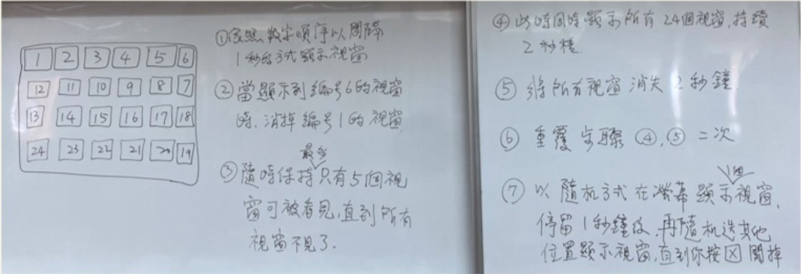

## AWT
- 視窗(Abstarct Windowing Toolkit)
```java
import java.awt.*;
import java.awt.event.*;;

public class tmp {
    static Frame frm = new Frame("new frame");
    static Label lab = new Label("hello world");
    public static void main(String args[]){
        frm.addWindowListener(new WindowAdapter() {
            public void WindowColsing(WindowEvent e){ System.exit(0); }
        });
        frm.setSize(400, 300);
        frm.setLocation(250, 250);
        frm.setBackground(Color.BLUE);
        frm.add(lab);
        frm.setVisible(true);
    }
}
```

## 元件介紹

- Panel : 包裝


## 第二題 題目要求
